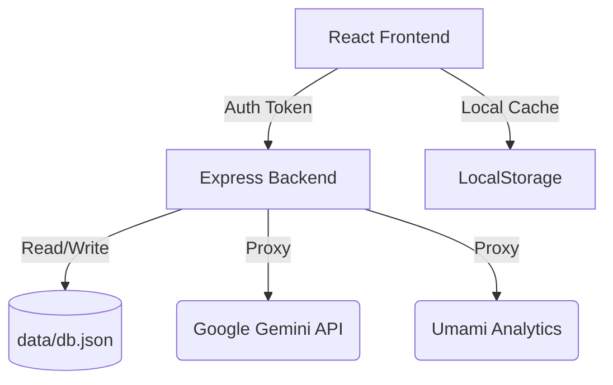

## System Architecture

Arcanum Vitae follows a hybrid SPA (Single Page Application) + API Proxy architecture.

### 1. Frontend Layer (React/Vite)

- **Framework**: React 18 with functional components and hooks.
- **State Management**: Primary state is managed in `App.tsx` (current view, data objects) and persisted locally via `localStorage` for performance and offline resiliency.
- **Routing**: Custom view-switching logic (not React Router) to maintain a seamless, immersive manifesto experience.
- **Styling**: Tailwind CSS for a "Brutalist/Industrial" aesthetic.

### 2. Backend Layer (Express/Node.js)

- **Role**: Serves the static build, handles administrative operations, and proxies external AI/Analytics requests.
- **Persistence**: A simple, file-based JSON database located at `data/db.json`.
- **AI Integration**: Proxies requests to Google Gemini to prevent exposing API keys to the client.

### 3. Analytics & Infrastructure

- **Tracking**: Integrated Umami analytics for privacy-focused tracking.
- **Process Management**: Managed by PM2 in production.
- **Routing**: Typically sits behind HAProxy which handles SSL termination and internal port forwarding.

## Data Flow

## Key Components

- **App.tsx**: The core orchestrator. Hydrates data from the server or local storage.
- **AdminDashboard.tsx**: A restricted UI for updating the manifesto contents and uploading media.
- **MusicView.tsx**: The primary media consumption interface.
- **server.ts**: The security and integration gateway.
